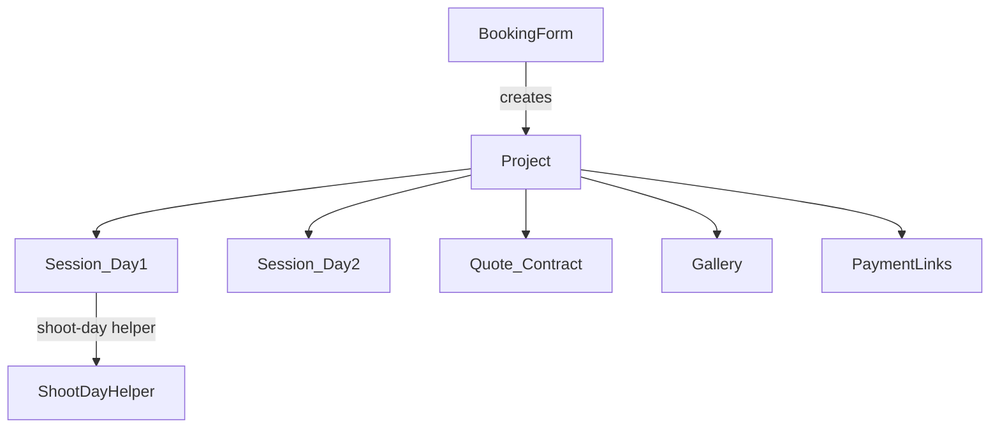

# Aura Studio OS roadmap (Pixieset-informed)

> **Canonical product brief.** Keep this file + `references/` in git. Last updated: 2026-07-26. **Phases 1–5 MVP scaffolded; active work = Phase 6 production depth.**

## Visual references (implement against these)

| File | Use when building |
|------|-------------------|
| [01-projects-list.png](references/01-projects-list.png) | Projects list/board IA |
| [02-home-quick-create.png](references/02-home-quick-create.png) | Dashboard quick-create |
| [03-inbox-out-of-scope.png](references/03-inbox-out-of-scope.png) | **Do not build** Inbox |
| [04-payments-invoices.png](references/04-payments-invoices.png) | Invoices UI |
| [05-payment-links.png](references/05-payment-links.png) | Payment link templates |
| [06-bookings-session-types.png](references/06-bookings-session-types.png) | Session types |
| [07-bookings-calendar.png](references/07-bookings-calendar.png) | Sessions calendar |
| [08-documents-contracts.png](references/08-documents-contracts.png) | Contracts list (**in scope**) |
| [09-templates.png](references/09-templates.png) | Templates hub (**in scope**) |
| [10-settings-branding-logos.png](references/10-settings-branding-logos.png) | Branding logos — no paywall |
| [11-settings-branding-theme.png](references/11-settings-branding-theme.png) | Color/font theme preview |
| [12-settings-integrations-gcal.png](references/12-settings-integrations-gcal.png) | Google Calendar — **no Zoom** |
| [13-settings-business-profile.png](references/13-settings-business-profile.png) | Business profile + timezone |
| [14-gallery-design-mobile.png](references/14-gallery-design-mobile.png) | Gallery Design controls |
| [15-gallery-homepage-settings.png](references/15-gallery-homepage-settings.png) | Gallery Homepage settings |
| [16-gallery-collection-sleek.png](references/16-gallery-collection-sleek.png) | Public `/g` quality bar |

Inspiration from Pixieset Studio Manager and Client Gallery. **Forever out:** Zoom, website builder, print store, Inbox.

## Locked product decisions

- **No feature paywalls**: Every studio capability we ship (custom logo, cover logo, default cover image, color/font themes, removing Aura marks on client-facing surfaces, gallery layouts, video, booking forms, payment links UI, etc.) is available to all studios. No “Upgrade / Plus / Pro” gates in Settings or elsewhere. (Stripe’s own card processing fees are unrelated — those are the payment network, not an Aura upsell.)
- **Clients → Projects**: Nav and primary entity rename. A Project holds contact fields (name/email/phone/notes), type, stage, paid total, and **many Sessions**. No separate Contacts CRM in this pass (keeps migration simple).
- **Shoots → Sessions**: Remove the single “photoshoot” job object as the hub. Sessions are dated occurrences under a Project (multi-day weddings, mini + full, etc.).
- **Workflow**: Quote / prep / delivery / wrap live on the **Project**. Shoot-day helper + checklist live on a **Session**. Gallery can attach to Project (shared delivery) with optional session tagging later.
- **Client gallery Design (studio-only)**: Photographers customize each gallery (cover style, theme, photo layout/color, PWA icon) with a **live phone preview** — inspired by Pixieset Mobile Gallery App Design. Clients view only; they cannot edit design. All options free (no paywall).
- **Public gallery quality bar**: Match Pixieset’s **sleek collection page** feel (hero + masonry + restrained chrome) — not a denser “admin-like” client view. No print store in the chrome.
- **Gallery Homepage (not a website builder)**: Optional public page that **lists the studio’s published collections/galleries** with simple Homepage settings (bio, contact toggles, password, sort). Fixed layout + branding — no drag-and-drop pages/blog.
- **Payments**: **Stripe Connect** — invoices + **reusable Payment Links** (Pixieset-style) first. Browser “tap to pay” is not real NFC; collect in-person via Checkout/Payment Link QR or Stripe Terminal later.
- **Payments cost model**:
  - **Building Aura ↔ Stripe**: no Stripe license fee; test mode free; API free.
  - **Client pays processing fees**: invoice/payment-link totals are **grossed up** so the studio nets the intended amount (e.g. $200 deposit → client charged ~$200 + Stripe %). Show a clear line item like “Processing fee” on the checkout/invoice. Default on for Aura; studio can still choose net pricing later if we add a toggle.
  - **Aura platform fees**: Connect with Stripe-handles-pricing; **no Aura `application_fee` in v1**.
  - Studios still complete Stripe KYC; payout timing applies.
  - **Compliance note**: US card-network surcharge rules vary by state/network — implement as a transparent processing/convenience fee on Aura Checkout/Payment Links (not a hidden markup), and keep amounts disclosed before pay.
- **Inbox / chat**: Not building (no two-way client messaging product).
- **Notifications & email**: transactional only via **Resend** + in-app bell — easy one-key setup; not a full Inbox.
- **Forever out of scope (do not build, do not revisit in this product)**:
  - **Print store** / lab fulfillment / print cart / Pixieset Store (outbound print-partner links only)
  - **Website builder** / marketing site / blog / freeform page CMS (Gallery Homepage collection index is OK)
  - **Zoom** (no Zoom meetings integration)
  - **Inbox** / two-way client messaging
- **Documents (in scope)**: Contracts (send + e-sign), Questionnaires, Quotes (evolve existing), and a **Templates** hub — Pixieset Documents/Templates IA. Free for all studios.
- **Email From domain (v1 easy setup)**: Aura sends from **one platform domain** (e.g. `notify@mail…`); **Reply-To** = studio business email. Studios do **not** each verify their own sending domain in v1.
- **What “per-studio custom domains” means** (deferred, not required):
  - **Custom email domain**: studio sends as `hello@wildflower.com` via Resend (each studio adds DNS). Skipped in v1 so signup stays easy.
  - **Custom gallery/homepage host**: `photos.wildflower.com` → Aura Homepage/galleries (DNS CNAME). Skipped in v1; use `/h/{slug}` and `/g/{token}` on Aura’s host instead.

## Map of your 9 asks → phases

| # | Ask | Phase |
|---|-----|--------|
| 2 | Projects + Sessions; drop photoshoot hub | 1 |
| 6 | Dashboard upcoming session → helper | 1 |
| 9 | Refine Ideas/Shots | 1 |
| 1 | Customize client gallery (Design) | 2 |
| — | Gallery Homepage settings | 2 |
| 3 | Videos in gallery | 2 |
| 5 + 8 | Payments + Payment Links | 3 |
| 4 | Booking forms | 5 |
| 7 | Inspiration only / no Inbox | forever out |
| — | Free branding settings (logo/cover/theme) | 1 |
| — | Business profile (esp. timezone) | 1 |
| — | Emails + in-app notifications (easy setup) | 1 |
| — | Documents (contracts, questionnaires, templates) | 4 |
| — | Google Calendar integration | 5 |

---

## Phase 1 — Projects, Sessions, dashboard, Shots UX, branding

### Data model
- Rename conceptually: `Client` → `Project` (collection migrate or dual-read), `Shoot` → `Session` with `projectId`, `startsAt`/`endsAt`, status.
- Project fields inspired by Pixieset list: name, contact, type, **stage** (inquiry → booked → in progress → delivered → completed), project date, paid amount (manual until Stripe).
- Migrate existing: each Client + its Shoots → one Project + N Sessions; rewire `proposal`/`gallery`/`shootPlan` foreign keys from `shootId` → `projectId` and/or `sessionId` as appropriate (`shootPlan`/`helper` → `sessionId`).

### Admin IA
- Nav: **Projects** (was Clients), Prep, Analytics, Settings. Optional later: Payments, Bookings (Phases 3–4).
- Project detail: sessions list, quote, prep (shot list attach), galleries, payments summary.
- Remove treating `/admin/shoots/[id]` as the only workflow home; wizard shell becomes project-centric with session picker for shoot day.

### Dashboard ([`src/app/admin/page.tsx`](src/app/admin/page.tsx))
- **Next up** card: next Session by `startsAt` (today/upcoming).
- Primary CTA: **Open shoot day** → existing helper at session route (today [`/admin/shoots/[id]/helper`](src/app/admin/shoots/[id]/helper/page.tsx)).
- Secondary: open Project workflow.

### Ideas / Shots refinement (keep, don’t clone Pixieset Templates)
Current: Ideas orphaned/redirected; shot lists in Prep; helper uses `ShootPlan` items ([`PrepStep`](src/components/wizard/steps/PrepStep.tsx), [`ShotListsPanel`](src/components/admin/ShotListsPanel.tsx), [`IdeasPanel`](src/components/admin/IdeasPanel.tsx)).

Refine to one clear model:
- **Shot library** (studio templates): name, category, must-have, optional reference image — merge Ideas into this.
- **Session plan**: copy from library + per-session checks (done/flagged) for helper.
- Friendlier UX: fewer fields up front, drag reorder, “add from library” on Prep, large tap targets on helper; drop dual Ideas vs Shot Lists mental model.

### Settings → Branding (Pixieset-inspired, fully free)
Expand [`/admin/settings`](src/app/admin/settings/page.tsx) / `Studio` beyond today’s logo + tagline. Mirror the useful controls from Pixieset Branding — **without** Upgrade / Plus / Pro locks:

- **Logos**: primary logo + optional cover/inverted logo (transparent PNG) — always available
- **Default cover image**: studio library + pick default for quotes, invoices, payment pages, booking site
- **Color theme**: background + accent (named presets + custom hex)
- **Font theme**: small set of display/body pairings (not a paywalled font catalog)
- **Live preview** pane: Documents / Email / Booking (as those surfaces exist) so studios see PAY NOW / quote chrome update live
- **No forced Aura badge** on client-facing docs/galleries that studios cannot remove — studio brand is first-class; optional discreet “Powered by Aura” only if we ever add it, and it must be toggleable for everyone (never a Pro unlock)

Persist on `Studio` (e.g. `logoUrl`, `coverLogoUrl`, `defaultCoverImageUrl`, `theme: { background, accent, fontPreset }`) and apply to public quote, gallery, payment, and booking surfaces.

### Settings → Business profile (required foundation)
Pixieset-style **Profile / Business profile** — shared across invoices, receipts, payment pages, booking site, calendar, and emails. Free for all studios.

Fields (editable in Settings):
- Business name (can default from `Studio.name`)
- First / last name (owner display)
- Email, website, phone
- Address (at least country + optional street/city/region/postal)
- **Time zone (IANA, e.g. `America/Denver`)** — critical
- Date format (`mm/dd/yyyy` vs `dd/mm/yyyy`, etc.)

**Timezone rules (locked in)**
- Persist `Studio.timeZone` (IANA string); default from signup locale or `America/Denver` until set.
- All **Session** `startsAt`/`endsAt` stored as UTC ISO; display and edit in the studio’s timezone.
- Dashboard “upcoming session”, shoot-day helper day boundaries, booking availability, Google Calendar event times, and invoice due dates all use `Studio.timeZone`.
- Never rely on the browser alone for “what day is this session” in admin APIs — convert with the studio timezone server-side when computing “today / upcoming”.

### Notifications & email (easy setup — not Inbox)

**Goal**: studios get notified and clients get transactional mail without DNS per studio, without a messaging Inbox, and with one platform secret.

**Provider (locked): [Resend](https://resend.com)**  
- One `RESEND_API_KEY` in App Hosting / `.env` — no SendGrid account maze.  
- Free tier (~3k emails/mo, 100/day) is enough to start; upgrade Resend only if volume grows.  
- **Single Aura sending domain** verified once (e.g. `mail.stroburm.app` or `notify.yourdomain`) — studios do **not** configure SPF/DKIM themselves in v1.  
- From: `"Wildflower Photography" <notify@mail…>` (studio business name)  
- **Reply-To**: studio business-profile email (replies go to the photographer, not Aura).

**Two channels**
1. **Email (clients + optional studio copy)** — Resend + small React Email templates branded with studio logo/colors when set.  
2. **In-app notifications (studio)** — Firestore `notifications/{id}` `{ studioId, type, title, body, href, read, createdAt }`; bell in admin shell; mark read. Covers “quote accepted”, “payment received”, “new booking” without building Inbox.

**Setup steps (ops)**
1. Create Resend account → API key → add `RESEND_API_KEY` to App Hosting secrets.  
2. Verify one sending domain in Resend (DNS once for Aura).  
3. Done — every studio inherits sending immediately.

**Studio Settings → Notifications** (toggles, all free)
- Email me when: quote accepted, payment received, booking submitted, gallery favorited (batch optional), contract viewed (later).  
- Email client when: quote shared, gallery ready (+ PIN reminder optional), payment receipt, booking confirmation.  
- Defaults: on for the high-value events above.

**Event catalog (wire as features land)**

| Event | Email client | In-app studio | Email studio |
|-------|--------------|---------------|--------------|
| Quote sent / shared | yes | — | optional |
| Quote accepted | — | yes | yes |
| Gallery live | yes | — | optional |
| Payment succeeded | receipt | yes | yes |
| Booking form submitted | confirmation | yes | yes |
| Session reminder (24h) | optional | yes | optional |

**Architecture**
- `src/lib/notify/send.ts` — `notifyStudio(...)` / `emailClient(...)`; no-ops cleanly if `RESEND_API_KEY` missing (dev).  
- Call from API routes after successful mutations (accept quote, Stripe webhook, booking create, gallery go-live).  
- Prefer **link in email** over embedding secrets; gallery/quote tokens stay in URLs as today.  
- Respect studio timezone for “tomorrow’s session” reminder copy.

**Explicitly not this phase**
- Two-way Inbox / “New Message”  
- Marketing blasts / newsletters  
- Per-studio custom From domain (deferred; see Locked decisions)

**Where to put `RESEND_API_KEY` (when implementing — never commit, never paste in chat)**
1. Local: `.env.local` → `RESEND_API_KEY=...` (gitignored)
2. Production: Firebase App Hosting secret / env for `RESEND_API_KEY` (same pattern as other private keys)
3. Also set `RESEND_FROM_EMAIL` (verified platform address, e.g. `Aura <notify@mail.yourdomain>`)

---

## Phase 2 — Client gallery Design + video

Pixieset reference: Mobile Gallery App → **Design** (Cover style, Theme, Photos layout & color, App icon) + live phone preview. Aura ships this as **web/PWA gallery Design** in Delivery — not a separate native app store product.

### Public gallery UX bar (Pixieset collection page)
Target the sleek client experience in the sample collection screenshot — rebuild/polish [`/g/[token]`](src/app/g) accordingly:

- **Hero**: full-bleed cover, title + date overlay, primary **View gallery** CTA; calm negative space below hero before the grid
- **Top chrome**: studio + collection name; icon actions only — favorites, download, share, slideshow (optional). **No Print Store / cart**
- **Masonry grid**: multi-column, mixed aspects, generous gaps, high-end spacing (not cramped cards)
- **Hover affordances** on tiles: favorite / download / share (subtle; don’t clutter idle state)
- **Typography**: expressive theme fonts from Design presets; all-caps or refined display per theme — avoid default system UI look
- **Motion**: 2–3 intentional transitions (hero enter, grid fade-in, lightbox) — presence, not noise
- Mobile: same hierarchy; sticky minimal actions; PWA install still supported

### Admin: Design tab (per gallery)
In project Delivery / gallery admin, tabs: Photos | **Design** | Settings — controls that produce the public look above:

**Cover style**
- Photo cover: **Full** / **Third** / **None**
- Change cover photo + set focal point
- Title / date / **View gallery** CTA placement driven by theme

**Cover theme** (named presets — fonts + layout on cover)
- Ship 4 free themes (Echo / Spring / Lark / Sage analogues) with distinct type + title placement
- Studio picks one; live preview updates

**Photos layout & color**
- Grid: masonry (default, Pixieset-like) / justified / columns
- Gap density, page background + accent (defaults from studio branding)
- Lightbox treatment

**App icon (PWA)**
- Custom icon for Add to Home Screen / [`manifest.webmanifest`](src/app/g/[token]/manifest.webmanifest/route.ts)

**Live preview**
- Phone + desktop preview of the **actual public gallery chrome** (hero + sample masonry), not a wireframe

### Data model
- `gallery.design: { coverStyle, coverPhotoId?, coverFocal?, themeId, gridMode, colors?, appIconUrl? }`
- Optional studio **default design** on new galleries; per-gallery override always allowed
- Public `/g/[token]` renders from `gallery.design` only (client has no design controls)

### Gallery Homepage settings (Pixieset Client Gallery Homepage — lean)
Public **collection index** for the studio — not a marketing website builder.

**Admin UI** (Settings or Galleries → Homepage):
- **Homepage on/off**
- **Public URL** — path like `/h/{studioSlug}` (unique slug on studio; copy button). Custom domains later optional; not required.
- **Homepage password** (optional) — gate the index; individual galleries keep their own tokens/PINs
- **Biography** (short text, ~500 chars)
- **Homepage info toggles** (from business profile): biography, social links, website, contact email, phone, business address
- **Collection sort order** (e.g. date created new→old, title)
- Per-gallery flag: **Show on Homepage** (default off for private client galleries; studio opts in for portfolio-style collections)
- Live mini-preview + **View site**

**Public page**
- Studio branding (logo, theme colors from Phase 1)
- Selected live galleries as cover tiles → `/g/{token}`
- No blog, no freeform pages, no SEO page builder

### Video
- Extend media pipeline: upload video → Storage path under `studios/{studioId}/...`, store poster frame + `kind: "video"` (or parallel `Video` entity).
- Public gallery: inline player in grid/lightbox; downloads policy (PIN / disable for video initially if needed).
- Watermarking: skip or burn poster only in v1 (full video watermark later).

---

## Phase 3 — Payments (Stripe Connect) + Payment Links

Pixieset reference: Payments → Invoices, **Payment Links**, Transactions, Payouts, Reports.

**In scope**
- Stripe Connect with **Stripe-handles-pricing** so Aura incurs **no Connect platform fees**. Prefer Standard / equivalent onboarding where studios complete Stripe KYC once.
- **Invoices** tied to Project (deposit / balance) with hosted Checkout.
- **Reusable Payment Links** (templates): fixed amount or client-chosen range (tips), title, description, optional image — shareable URL; same idea as Pixieset’s Tips / Deposits / Workshop cards.
- **Fee pass-through (locked)**: when creating Checkout Session / Payment Intent / Invoice, compute charge so **studio nets the listed price**. Example for ~2.9% + $0.30: `charge = ceil((net + 0.30) / (1 - 0.029) * 100) / 100`. Surface “Processing fee” as its own line (or Checkout amount breakdown) so the client sees why the total is higher. Record `netAmount` + `processingFee` + `grossAmount` on the transaction.
- Webhooks update Project `paid` using **net** toward the project balance (studio’s intended amount).
- Dashboard/Home: paid / upcoming / past due summary.
- **No Aura cut in v1**.

**Wallets / Cash App / Venmo**
- **Cash App Pay**: yes via Stripe (US). Enable on Checkout / Payment Element alongside cards; works with Connect for eligible US studios. Include in Phase 3 payment-method set (no separate Cash App API).
- **Apple Pay / Google Pay**: typically available through Stripe Checkout with little extra work — enable too.
- **Venmo**: **not a first-class Stripe payment method** today. Options: (1) skip for v1; (2) later add **PayPal / Braintree** (Venmo’s merchant path) as a second processor — more complexity and dual reconciliation. **Plan default: Cash App Pay yes; Venmo deferred** unless we explicitly add PayPal later. Personal @venmo P2P links are not a proper business integration (no reliable webhooks/receipts).

**Cost answer**
- Free to integrate and run in test mode; free for Aura as platform under this model.
- Client pays the Stripe processing fee via gross-up; studio receives the intended net.

**Tap to pay**
- Not in first ship: web cannot do Apple/Google NFC tap-to-pay.
- Near-term in-person: show Payment Link / Checkout **QR** on phone.
- Later optional: Stripe Terminal / Tap to Pay on iPhone (native), out of this web pass.

**Out of scope here**: Venmo (unless PayPal phase later). Print store already locked out globally (see decisions above).

---

## Phase 4 — Documents (in scope)

Pixieset reference: Documents → Contracts / Questionnaires / Quotes; Templates hub (`08`, `09` screenshots).

**Why it was deferred before:** e-sign + document templates is real product surface. **Now in scope** — studios need contracts and questionnaires, not only quote accept.

**In scope**
- **Contracts**: create from template, attach to Project, send link, client e-sign (typed name + consent timestamp minimum; draw signature nice-to-have), statuses draft / awaiting signature / completed / canceled
- **Questionnaires**: reusable forms; send per Project; answers land on Project/intake (can replace/adjoin current proposal intake)
- **Quotes**: keep/evolve existing `/p/[token]` proposals under Documents IA
- **Templates** hub: Contracts / Invoices / Questionnaires / Quotes / Emails tabs (start with Contracts + Questionnaires + Quotes; email templates as notify wrappers mature)
- Branding preview on documents (cover image, colors, fonts from Settings)
- Notify studio + client on send / signed (Resend + in-app)

**Not Documents scope**: website pages, blog, print store product menus.

---

## Phase 5 — Booking forms + Google Calendar

Pixieset reference: Bookings → Session Types, Sessions, Calendar, Booking Site; Settings → Integrations → Google Calendar (`06`, `07`, `12`).

### Booking forms (lean)
- **Session types** (duration, base price, buffer, questionnaire fields) — can grow from package templates / Documents questionnaires.
- Public **booking form** link: creates Project + Session.
- Studio reviews/confirms; optional deposit Payment Link attach.
- In-app calendar list/month of Sessions.

### Google Calendar integration (free for all studios)
- OAuth connect; push sync Session ↔ Calendar; `googleEventId` on Session
- Free-busy for booking slots
- Disconnect in Settings; **no Zoom**
- Optional Google Meet only if nearly free with Calendar API

---

## Forever out of scope

- Inbox / New Message / conversations
- Website builder / marketing site / blog CMS
- Print store / lab fulfillment / product cart
- Zoom
- (Deferred only, not forever): per-studio custom email From domain; custom gallery hostname

---

## Status after Phases 1–5 (2026-07-26)

MVP scaffold is in the repo. Remaining work is **Phase 6 — production depth** (not new pillars).

| Pillar | MVP today | Gap |
|--------|-----------|-----|
| Resend | `notify/send.ts` + bell; some booking notify | Secrets/domain; full event catalog; Settings toggles |
| Stripe | Gross-up + links UI; Connect stub | Live Checkout, webhooks, Cash App Pay, paid=net |
| Gallery | Design + hero/masonry pass | Match refs `14–16` |
| Calendar | List + busy check | Month/week UI; GCal push on confirm |
| Documents | Contract + questionnaire MVP | Draw e-sign; templates IA; quotes under Documents |

---

## Phase 6 — Production depth (NEXT)

Order: **Resend wire → Stripe real → gallery polish → calendar UI → documents depth**.

### 6a — Resend ops + full event wiring
1. Rotate any leaked key; set `RESEND_API_KEY` + `RESEND_FROM_EMAIL` in `.env.local` and App Hosting.
2. Verify one Aura sending domain in Resend (Reply-To = studio email).
3. Optional Cursor MCP: `"resend": { "url": "https://mcp.resend.com/mcp" }`.
4. Wire event catalog (quote sent/accepted, gallery live, payment receipt, booking submit/confirm, contract/questionnaire send/complete).
5. Settings → Notifications toggles respected by send helpers.

### 6b — Real Stripe Connect
- Checkout Sessions on connected accounts; webhook → transaction + Project `paidAmount` += net.
- Live Payment Links / invoices; processing fee line; Cash App Pay + wallets via Checkout.
- Authenticate Stripe Cursor MCP when implementing; never commit secrets.

### 6c — Gallery polish (refs 14–16) ✅
- `/g` hero + View gallery CTA; chrome without print store; masonry + motion + theme fonts.
- Design preview parity; Homepage settings polish (ref `15`).

### 6d — Fuller calendar + GCal
- Bookings month/week calendar; confirm pushes Google event when connected; busy checks stay.

### 6e — Documents depth
- Draw e-sign; templates hub (contracts / questionnaires / quotes); quotes under Documents IA; Project-visible questionnaire answers; notify on lifecycle events.

## Ops prerequisites (Phase 6)

- Resend domain + keys; Stripe Connect + webhook secret; Google OAuth client
- Cursor MCPs: Resend URL; Stripe plugin (auth required)
- Keep `docs/studio-os/` + references in git

## Suggested build order

1. ~~Phase 1–5 MVP~~ (shipped scaffold)
2. **Phase 6** — Resend → Stripe → gallery polish → calendar → documents depth

## Verify
- 6a: Real inbox email; toggles work; catalog events fire.
- 6b: Test-mode Checkout + webhook; paid=net; Cash App where eligible.
- 6c: `/g` matches quality bar; no print store chrome.
- 6d: Month calendar; confirm syncs GCal when connected.
- 6e: E-sign completed; templates hub + quotes under Documents.
